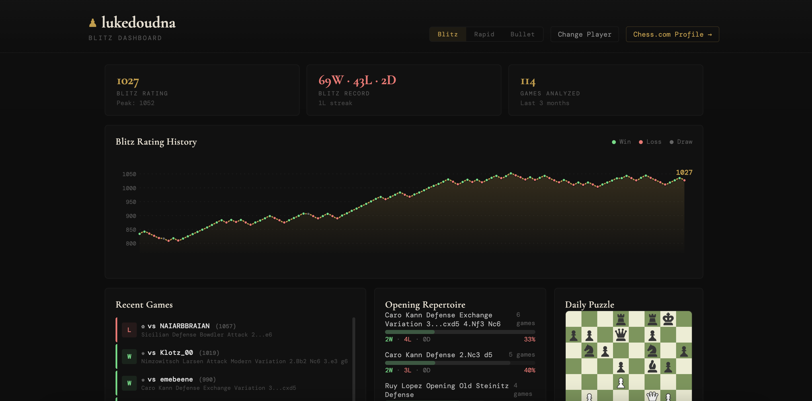

# Chess Dashboard

A chess analytics dashboard that pulls data from the Chess.com public API and gives players actionable insights into their performance.

**Live demo:** [chess-dashboard-two.vercel.app](https://chess-dashboard-two.vercel.app/)



## What It Does

Enter any Chess.com username and get a full breakdown of their playing data:

- **Rating history chart** — D3-powered line chart showing rating over time, with each game colored by result
- **Recent games** — Last 10 games with opponent, opening, and result, linked to Chess.com
- **Opening repertoire** — Most-played openings with win/loss/draw breakdown and win percentage
- **Performance by color** — Win rate and net rating change as White vs Black
- **Player insights** — Tilt detection (win rate after a loss vs after a win), performance by time of day, rating change per opening, and average game length analysis
- **Daily puzzle** — Link to the Chess.com daily puzzle
- **Time control toggle** — Switch between Blitz, Rapid, and Bullet views

## Technical Details

- **React** with Vite for fast development and builds
- **D3.js** for the rating history chart
- **Chess.com PubAPI** — free, public, no authentication required
- **Fully client-side** — no backend, no database, no API keys
- Deployed on **Vercel** with automatic deploys from GitHub

### Key Concepts

- Async data fetching with error handling and loading states
- PGN parsing to extract opening names from game notation
- Multi-source API aggregation (stats, game archives, puzzle endpoints)
- Derived analytics computed from raw game data (tilt detection, time-of-day bucketing, per-opening rating deltas)

## Run Locally

```bash
git clone https://github.com/lukee-d/chess-dashboard.git
cd chess-dashboard
npm install
npm run dev
```

## What I'd Add Next

- Longer historical data (currently analyzes last 3 months)
- Head-to-head comparison between two players
- Win rate trends over time (rolling average)
- Opponent rating distribution analysis